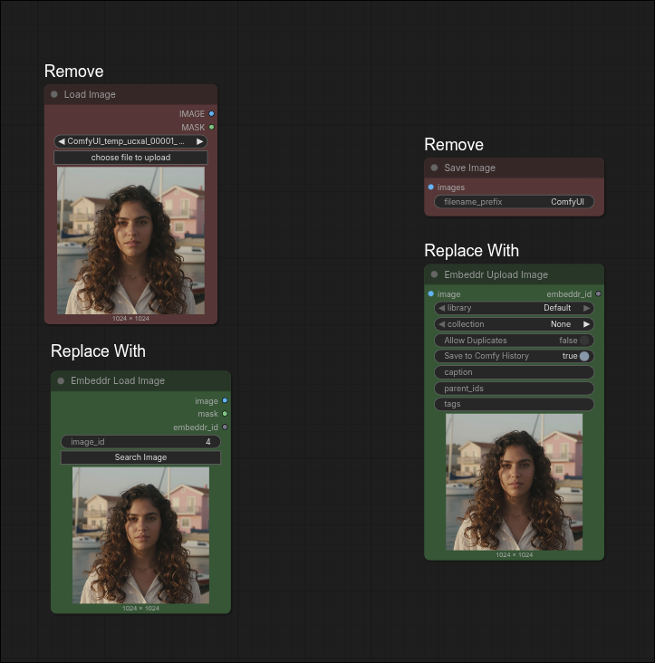
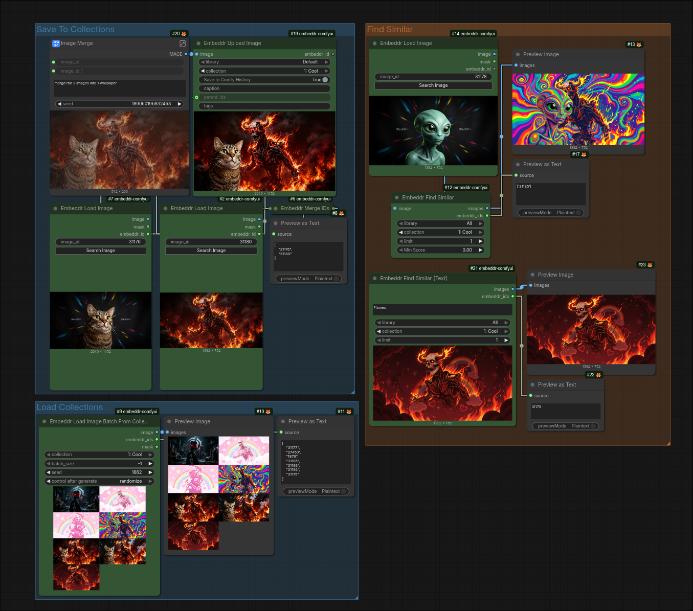

<div align="center"><a name="readme-top"></a>


<h1>Embeddr ComfyUI Extension</h1>
</div>

> [!WARNING]
> Requires [embeddr-cli](https://github.com/embeddr-net/embeddr-cli) to be running.


## Installation

1. Download [latest release](https://github.com/embeddr-net/embeddr-comfyui/releases)
2. Extract into `comfyui/custom_nodes`
3. [Install Embeddr-CLI](https://github.com/embeddr-net/embeddr-cli?tab=readme-ov-file#installation)
4. Run Embeddr-CLI with `embeddr serve`
5. Run ComfyUI


## Usage


### Use New Load & Save Image




### Retrieve from your collections




### Access more info on the [WebUI](https://github.com/embeddr-net/embeddr-cli) 


## Development

To get a development version working.

```sh
git clone https://github.com/embeddr-net/embeddr-comfyui
cd embeddr-comfyui
pnpm install
pnpm build

# Link into ComfyUI custom_nodes
# Example:
ln -s /home/user/git/embeddr-comfyui \
    /home/user/comfyui-dev/custom_nodes/embeddr-comfyui
```
